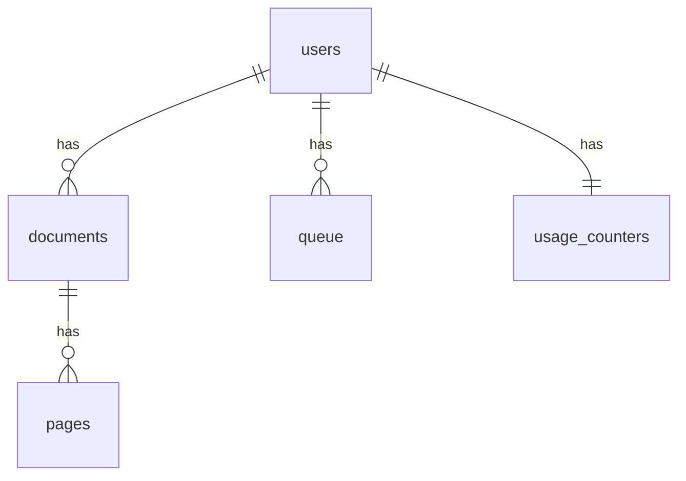

# Phone data — what lives where

## Tables (phone SQLite later, memory now)
- `users`: guest id per install. No login.
- `documents`: id, title, status (ready/needs_review/failed).
- `pages`: id, image path, kept with its paper.
- `queue`: send-later jobs (upload/export/ai) + tries.
- `usage_counters`: free scans used (max 5). Take max(phone, server) on sync.

## Rule
- No internet? Save on phone. Never lose a paper.
- Internet back? Send queue oldest first. One fail never blocks the rest.
